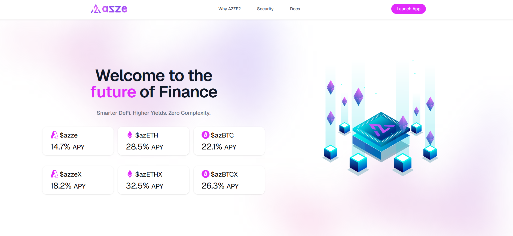
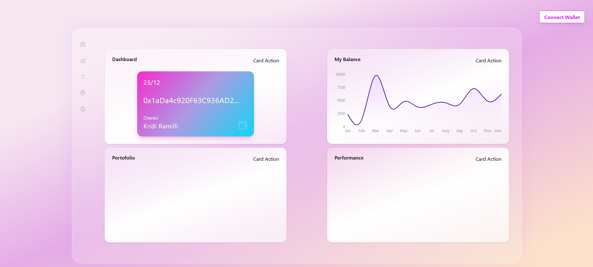
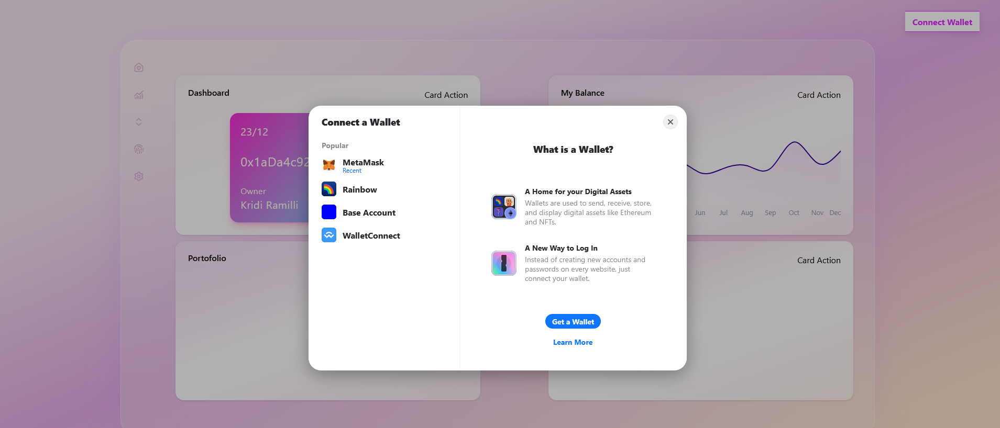

# 🚀 AZZE

<p align="center">
  
</p>

<p align="center">
  
  
</p>

A modern Crypto APP **DeFi Yield Aggregator** built with **Next.js 16**, **React 19**, and **TypeScript**. AZZE helps users compare, simulate, and maximize returns across leading decentralized finance protocols through a clean, responsive, and interactive interface.
---
## ✨ Features

* 💰 Yield comparison dashboard
* 📈 APY comparison charts
* 🧮 Yield simulator
* 🌐 Modern landing page
* 🎨 Dark / Light theme
* 📱 Fully responsive UI
* ⚡ Smooth animations
* 📊 Interactive data visualizations
* 🔗 Web3-ready architecture

---

## 🛠 Tech Stack

### Frontend

* Next.js 16
* React 19
* TypeScript
* Tailwind CSS v4
* Radix UI
* Motion
* Three.js
* Recharts
* Lucide Icons
* Lottie Animations

---

## 📂 Project Structure

```
app/
│
├── dashboard/
├── layout.tsx
├── page.tsx
└── globals.css

components/
│
├── Hero
├── Navbar
├── Footer
├── APYTable
├── YieldSimulator
├── YieldCard
├── ComparisonBars
├── PartnersSection
└── ui/

lib/
│
├── getAPY.ts
└── utils.ts

public/
```

---

## 🚀 Getting Started

Clone the repository

```bash
git clone https://github.com/yourusername/AZZE.git
```

Navigate into the project

```bash
cd AZZE
```

Install dependencies

```bash
npm install
```

Run the development server

```bash
npm run dev
```

Open your browser

```
http://localhost:3000
```

---

## 📦 Production

Build

```bash
npm run build
```

Start

```bash
npm start
```

---

## 📜 Scripts

| Command       | Description        |
| ------------- | ------------------ |
| npm run dev   | Development server |
| npm run build | Production build   |
| npm run start | Start production   |
| npm run lint  | Run ESLint         |

---

## 📸 Screenshots

Create a folder named **screenshots** inside the repository.

```
screenshots/
│
├── hero.png
├── dashboard.png
├── simulator.png
├── apy.png
└── mobile.png
```

---

## 🌐 Future Roadmap

* Wallet connection
* Live APY feeds
* Portfolio tracking
* Cross-chain support
* Strategy optimizer
* AI-powered yield recommendations
* Transaction history
* Notifications

---

## 🤝 Contributing

Contributions are welcome.

Feel free to fork the project, create a feature branch, and submit a Pull Request.

---

## 📄 License

This project is licensed under the MIT License.

---

## 👨‍💻 Author

Developed by **Kridi Ramilli**.
